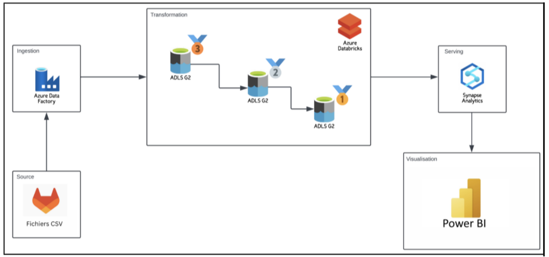

# Projet Data Engineering on Azure – Medical Data Warehouse

## Réalisé par :
- Darryll Genève Junior JOSEPH  
- Mariem BEN SALAH  
_Mastère Data Engineering & IA – Année scolaire 2024–2025_

---

## Résumé du projet

Ce projet vise à construire une **architecture cloud native** complète sur **Microsoft Azure** pour ingérer, transformer, modéliser et visualiser des données hospitalières simulées. L’approche adoptée repose sur les bonnes pratiques du modèle **Lakehouse**, la méthode **ELT** et l’usage de technologies cloud modernes et sécurisées.

---

## Objectifs principaux

- Construire une architecture Lakehouse : Bronze → Silver → Gold
- Nettoyer, enrichir et standardiser les données médicales
- Mettre en œuvre un **data model en étoile** dans Azure Synapse
- Automatiser les traitements avec Azure Data Factory
- Créer des dashboards interactifs dans **Power BI**

---

## Jeu de données

- **Nom** : MedSynora – Medical Data Warehouse  
- **Source** : Kaggle  
- **Contenu** : Données simulées pour l’année 2024 – patients, consultations, diagnostics, traitements, coûts, etc.

---

## Technologies utilisées

| Catégorie            | Outils/Services Azure                            |
|----------------------|--------------------------------------------------|
| Stockage             | Azure Data Lake Storage Gen2 (ADLS)             |
| Traitement           | Azure Databricks (PySpark)                      |
| Ingestion API        | GitLab API                                      |
| Orchestration        | Azure Data Factory                              |
| Modélisation         | Azure Synapse Analytics (modèle en étoile)      |
| Visualisation        | Power BI connecté à Synapse Serverless          |
| Sécurité             | IAM, Managed Identity, chiffrement AES-256      |

---

## Pipeline de traitement

1. **Bronze** : Ingestion des fichiers CSV depuis GitLab via API → stockage brut dans ADLS  
2. **Silver** : Nettoyage, enrichissement, dé-duplication, traduction des libellés  
3. **Gold** : Agrégation, calcul de KPIs, structuration pour l’analyse  

---

## Modélisation dans Azure Synapse

### Tables de dimensions :
- Dim_Date
- Dim_Patient
- Dim_Allergie
- Dim_Medecin
- Dim_Chambre
- Dim_Maladie

### Tables de faits :
- Fact_Consultation
- Fact_Traitement
- Fact_SignesVitaux
- Fact_Cout
- Fact_CoutTraitement

---

## Dashboards Power BI

Deux rapports ont été développés :

1. **Vue institutionnelle** : Suivi des indicateurs 2024 :  
   - Nombre de patients, consultations, médecins
   - Coûts mensuels
   - Répartition par sexe, âge, nationalité

2. **Vue individuelle** : Profil d’un patient   
   - Allergies, historique de diagnostics, courbes de dépenses

> Le fichier PBIX est disponible dans le dépôt :  
`Visualisation_Projet_Data_Engineering_AZURE.pbix`

---

## Sécurité & gouvernance

- Chiffrement des données au repos et en transit
- Identités managées et rôles IAM restreints
- Surveillance via Azure Monitor
- Redondance géographique (GRS) activée

---

## Architecture globale

Un pipeline complet, automatisé, scalable et sécurisé :
